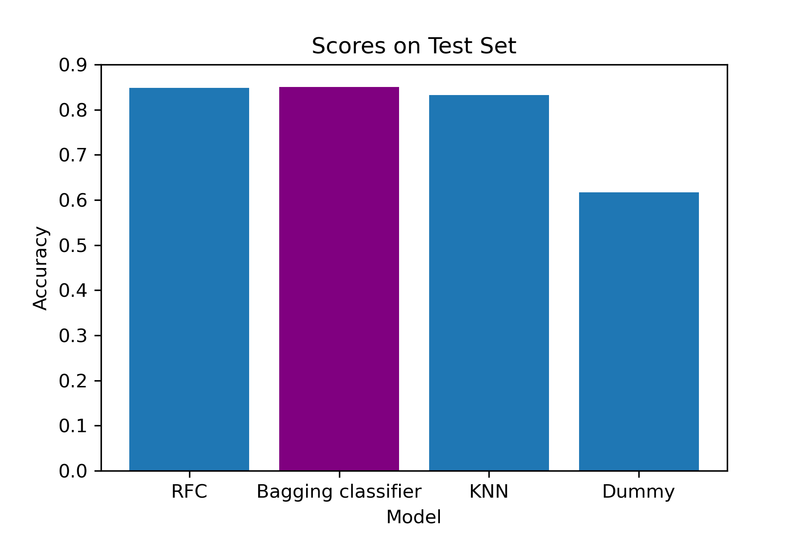
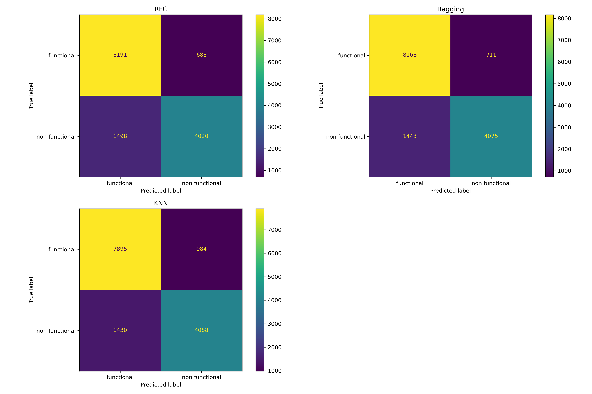
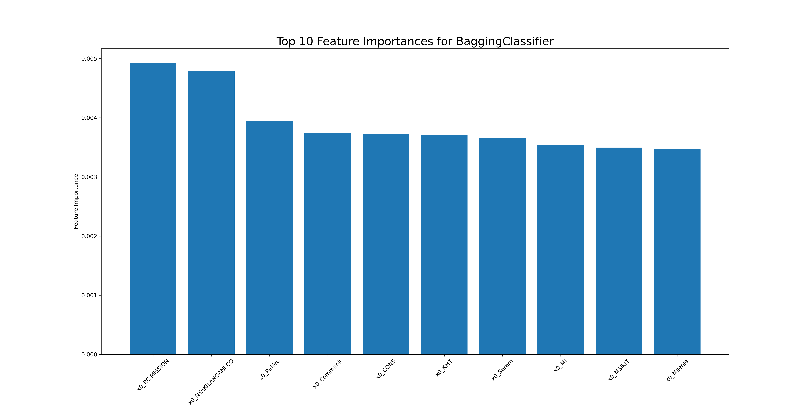

# Classification Models to Identify Water Pump Functionality in Tanzania


# Overview

This project consists of classification models to identify water pump functionality in Tanzania. Limited access to safe water is a major health risk. These models are potential tools for government agencies or non-governmental organizations to identify areas with limited access to clean water. Through an iterative modeling process, we produced a model that predicted pump functionality with 85% accuracy. By identifying non-functional water pumps, organizations can divert resources to areas in need of assistance and improve water access and health in Tanzania.

# Business Understanding

Millions of people in Tanzania lack access to safe water. This results in paying high prices for water from vendors or collecting water from unsafe natural sources. In order to combat this problem, resources must be allocated to fix non-functioning water distribution points. Age is an important metric in predicting the condition of distribution points. Older pumps and engine systems are more likely to fail than newer ones. In many cases age related data is not available. The goal of this analysis is to build the model that can predict the condition of waterpoints based on their other features such as regional factors, installer, type of pump, population and others.

# Data Understanding and Analysis

The data was sourced from the Taarifa waterpoint dashboard, which aggregates data from the Tanzania Ministry of Water. The information collected was recorded by GeoData Consultants Ltd. There are 59,400 rows and 40 columns in the "water_well_train_data.csv".

Our target data is stored in "water_well_train_labels.csv". There are 59,400 rows and 2 columns in this csv file. The two columns in this csv file are 'id' and 'status_group'. The 'id' column aligns with the 'id' column in the "water_well_train_data.csv" file. Our target column is 'status_group' which consists of three values describing the status of a water pump: "functional", "functional needs repair", and "non-functional".

# Results

Using an iterative model building process, we developed three different types of models and evaluated their accuracy scores. 

Based on accuracy score alone, the Bagging classifier was our strongest performing model. The test scores for all three models were relatively close. Bagging classifier was at the top with 85.0% accuracy, the Random Forest classifier had 84.8% accuracy, and the K-Nearest Neighbors classifier had 83.2% accuracy.



While model accuracy is important, other metrics such as precision and recall are important in evaluating model performance with specific regard to model sensitivity to different pump functionalities.

Our goal with these models is to identify non-functional pumps so that organizations can perform repair or replacement. Therefore we've defined 'non functional' as the "positive" case for these precision and recall scores. Recall was the more important metric. In this scenario, recall measures how many non-functional pumps our models are able to detect out of all the non-functional pumps in the dataset. 'False negatives' (i.e. classified 'functional' when it is actually 'non functional') represent a greater risk to water access as pumps that are in need of attention could get overlooked if misclassified by the model.




Out of our three models, the KNN model has the highest recall score for the 'non functional' category at 0.741. This means that for the test data, it correctly classified 74.1% of non-functional pumps out of all true non-functional pumps in the dataset.The other two models have recall scores within 1-2%: Bagging had a recall score of 0.738 and Random Forest had a recall score of 0.726.

Precision scores for our models were higher than the recall scores. KNN underperformed in precision, lagging behind the other two models at 0.806. Bagging and RandomForest had precision scores around 0.85.

In choosing a best model, we wanted to take both accuracy and recall into account. Overall, Bagging is our best model with an accuracy score of 0.850 and a recall score of 0.738. The low recall score is a feature we'd like to address if we continued to improve on this model in the future. Given that the precision score for these models is higher than the recall scores, there is room for a tradeoff between recall and precision. Increasing sensitivity to non-functional pumps would improve recall and reduce the number of 'false negatives'.



The top feature importances for the Bagging classifier were all OneHotEncoded features from the 'installer' column. This suggests the 'installer' feature is important to the Bagging classifier's splitting decisions. This suggested there is some sort of relationship between pump installation 
and pump functionality that could warrant further exploration. There might be a reason why our model highlighted these 10 installers and could be worth 
future investigation.


# Conclusion

After iterating over several models and model types, we developed a Bagging classifier to determine a water pump's functionality based on regional information, management and installation information, water quality and amount, and pump characteristics.

Our best performing model is a BaggingClassifier with DecisionTreeClassifiers as the base estimator. This model had an accuracy score of 0.850, meaning it correctly classified a pump's functional status 85% of the time. Our best model was limited in its sensitivity towards the non-functional class. While it correctly classified 73.8% of all non-functional cases, the model still has room for improvement. Improving the model's recall for non-functional water pumps would improve its efficacy in identifying places where people lack access to clean water. The top feature importances for the model were all related to 'installer', the organization/individual responsible for installing the water pump. This indicates that 'installer' has some implications in predicting a pump's functionality and highlights pump installation as a possible area for organizations to investigate.

This model is a tool for organizations seeking to improve water access in Tanzania. Due to the limited data available on the age of each water pump, our model could be used when age data is not readily available and look at other features in order to classify pump funtionality. Both government agencies and non-governmental organizations could use the model to where pumps are non-functional and provide aid to people who are unable to access safe sources of water.
Further steps

Here are some areas for further investigation to produce an improved model:

- Improve sensitivity to non-functional pumps: People around non-functional pumps lack access to clean water. Correctly identifying cases of non-functional pumps is critical to improving water access for Tanzanians.

- Reduce model complexity: The model currently takes in 17 features. Given the challenge of collecting information to feed into the model, a model that can make predictions when less infomation is available could be a more useful prediction tool. The challenge is to balance model performance with reduced complexity/information availability.

## Repository Structure
```
├── data
│   ├── water_well_test_values.csv
│   ├── water_well_train_clean.csv
│   ├── water_well_train_data.csv
│   └── water_well_train_labels.png
├── notbooks_scratch
│   ├── Anton modeling.ipynb
│   ├── Anton-modeling2.ipynb
│   ├── Anton.ipynb
│   ├── Yuhkai_EDA.ipynb
│   └── Yuhkai_modeling.ipynb
├── visualizations
│   ├── bagging_importances.png
│   ├── bagging_importances_cleaned.png
│   ├── confusion_matrices.png
│   ├── model_identification_results.png
│   ├── rfc_importances.png
│   └── test_accuracy_scores.png
├── .gitignore
├── README.md
├── main_notebook_cleaning.ipynb
├── main_notebook_modeling.ipynb
├── notebook_cleaning.pdf
├── notebook_modeling.pdf
└── presentation_tanzania_water_pumps.pdf 
```
